Final\_class\_project
================
Christopher Ebuka Ojukwu
4/23/2023


## Consensus Peaks Creation
``` r
# filepath to import peaks
broadpeakfilepath <- "/scratch/Shares/rinnclass/CLASS_2023/data/data/peaks"

#import peaks
#peak_list <- import_peaks(consensus_file_path = broadpeakfilepath)

# Creating unique DBP object for create_consensus_peaks_from_reduced
dbp <- unique(sapply(names(peak_list), function(x) {
  unlist(strsplit(x, "_"))[1]
}))

# now run our function consensus_from_reduced
consensus_list <- lapply(dbp, consensus_from_reduced, peak_list)

# adding names to the GRange list
names(consensus_list) <- dbp
```

## Finding out the number of peaks
``` r
# creating list of num_peaks per dbp
num_peaks <- sapply(consensus_list, length)

# plotting
hist(num_peaks, breaks = 1000)
hist(num_peaks, breaks = 1000, xlim = c(0,3000))

ggsave("/scratch/Shares/rinnclass/CLASS_2023/Christopher/CLASS_2023/CLASSES/final_project/analysis/01_create_consensus_peaks/figures/hist_num_peaks.pdf")
```
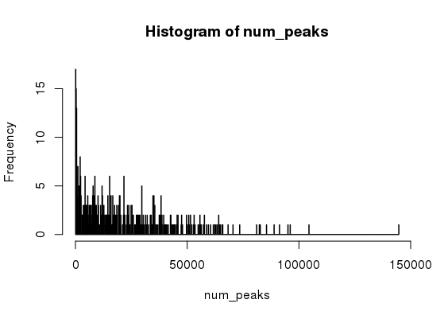

## Looking at just the first 3000
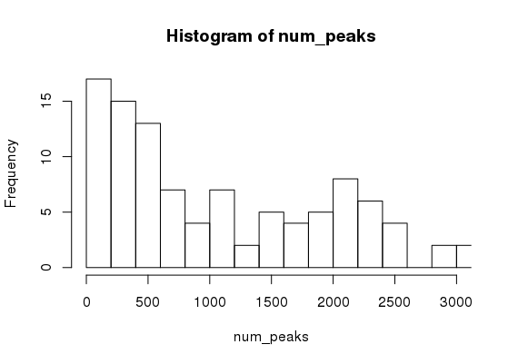

## Filtering the consensus list 
``` r
# Filter out any chip data less 1,000 peaks == filtered consensus peaks
filtered_consensus_list <- consensus_list[sapply(consensus_list, length) > 1000]

# saving 
save(filtered_consensus_list, file = "results/filtered_consensus_list.RData")

# keeping track of DBPs lost
lost_dbps <- names(consensus_list[sapply(consensus_list, length) < 1000]) %>% as.data.frame()

# saving 
write.table(lost_dbps, "results/lost_dbps.csv")
```
Result: There are 56 total dpbs that the metric has filtered out.

## Exporting filtered consensus list and consenus list
``` r
for(i in 1:length(filtered_consensus_list)) {
  rtracklayer::export(filtered_consensus_list[[i]], 
                      paste0("results/filtered_consensus_peaks/", 
                            names(filtered_consensus_list)[i], 
                             "_filtered_consensus_peaks.bed"))
}

for(i in 1:length(consensus_list)) {
rtracklayer::export(consensus_list[[i]], paste0("results/consensus_peaks/", names(consensus_list)[i],"_consensus_peaks.bed")) }
```

## Making consensus file list
``` r
consensus_file_list <- list.files("/scratch/Shares/rinnclass/CLASS_2023/Christopher/CLASS_2023/CLASSES/final_project/analysis/01_create_consensus_peaks/results/consensus_peaks", full.names = T, pattern = ".bed")

# lapply (for loop) across consensus file list to add colnames
# The actual col names for .broadPeak are: chr, start, end, name, score, strand
peaks <- lapply(consensus_file_list, read.table, col.names = c("chr", "start", "end", "name", "score", "strand"))
names(peaks) <- dbps

# double check order by looking at consensus_file_list is same order as dbps
# make chromosomes of interest object
canonical_chr <- c(paste0("chr", 1:22), "chrM", "chrX", "chrY")

# let's use lapply with filter funciton to cannonical_chr
peaks <- lapply(peaks, function(x) x %>% filter(chr %in% canonical_chr))

# now that these are all nice and clean let's export:
new_filenames <- paste0("consensus/", names(peaks), "_consensus.bed")

for(i in 1:length(peaks)) {
  write.table(peaks[[i]], new_filenames[[i]],
              sep = "\t", col.names = FALSE, row.names = FALSE,
              quote = FALSE, append = TRUE)
}
```

## Loading and exploring genome features
``` r
# What is the distribution of promoter overlaps versus gene-bodies (hint hist)
gencode_gr <- rtracklayer::import("/scratch/Shares/rinnclass/CLASS_2023/data/da#ta/genomes/gencode.v32.annotation.gtf")

# gencode genes
gencode_genes <- gencode_gr[gencode_gr$type == "gene"] 

# mrna_genes
mrna_genes <- gencode_genes[gencode_genes$gene_type %in% "protein_coding"]

# lncrna_genes
lncrna_genes <- gencode_genes[gencode_genes$gene_type %in% "lncRNA"] 

# mrna_lncrna_genes
mrna_lncrna_genes <- gencode_genes[gencode_genes$gene_type %in% c("protein_coding","lncRNA")]

# lncrna_mrna_promoters
lncrna_mrna_promoters <- promoters(mrna_lncrna_genes, upstream = 1000, downstream = 1000)

# lncrna_gene_ids
lncrna_gene_ids <- mrna_lncrna_genes$gene_id[mrna_lncrna_genes$gene_type == "lncRNA"]

# mrna_gene_ids
mrna_gene_ids <-mrna_lncrna_genes$gene_id[mrna_lncrna_genes$gene_type == "protein_coding"]
```

## Tracking filtered consensus peaks
``` r
#numpeaks to track peak properties
num_peaks_df <- data.frame("dbp" = names(filtered_consensus_list),
                           #"num_peaks" = sapply(filtered_consensus_list, #length))

# total genome covered by peaks
num_peaks_df$total_peak_length <- sapply(filtered_consensus_list, function(x) sum(width(x)))

# creating number of promoter overlaps entry
promoter_peak_counts <- count_peaks_per_feature(lncrna_mrna_promoters, filtered_consensus_list, type = "counts")

# creating promoter peak_occurence for clustering - Metaplots later.
promoter_peak_matrix <- count_peaks_per_feature(lncrna_mrna_promoters, filtered_consensus_list, type = "occurrence")

# saving
write.table(promoter_peak_matrix, "results/promoter_peak_occurrence_matrix.tsv")

# read back in
promoter_peak_occurrence_matrix <- read.table("results/promoter_peak_occurrence_matrix.tsv")

#summing rows to get total number of promoter overlaps
num_peaks_df$peaks_overlapping_promoters <- rowSums(promoter_peak_counts)

# lncrna promoter overlaps 
num_peaks_df$peaks_overlapping_lncrna_promoters <- rowSums(promoter_peak_counts[,lncrna_gene_ids])

# mrna promoter overlaps
num_peaks_df$peaks_overlapping_mrna_promoters <- rowSums(promoter_peak_counts[,mrna_gene_ids])

# Finding overlaps with gene_bodies (will take a few minutes again)
# Note this takes several minutes
genebody_peak_counts <- count_peaks_per_feature(mrna_lncrna_genes, 
                                                filtered_consensus_list, 
                                                type = "counts")

# All gene bodies overlaps
num_peaks_df$peaks_overlapping_genebody <- rowSums(genebody_peak_counts)

# lncRNA gene bodies 
num_peaks_df$peaks_overlapping_lncrna_genebody <- rowSums(genebody_peak_counts[,lncrna_gene_ids])

# mRNA gene bodies
num_peaks_df$peaks_overlapping_mrna_genebody <- rowSums(genebody_peak_counts[,mrna_gene_ids])
```

## Finding out proteins that are TFs and most recurring dbd
``` r
# download TF annotations to results
url <- "https://www.cell.com/cms/10.1016/j.cell.2018.01.029/attachment/ede37821#-fd6f-41b7-9a0e-9d5410855ae6/mmc2.xlsx"
destination_for_url <- "results/TF_annotations.xlsx"

# to download we can use download.file
download.file(url, destination_for_url)

# reading in TF annotations 
human_tfs <- readxl::read_excel("/scratch/Shares/rinnclass/CLASS_2023/Christopher/CLASS_2023/CLASSES/final_project/analysis/01_create_consensus_peaks/results/TF_annotations.xlsx",
                                sheet = 2, skip = 1)

# let's rename the 4th column to indicate if it is a TF.
names(human_tfs)[4] <- "is_tf"
names(human_tfs)[3] <- "dbp"

# now let's intersect gene names that are in our ChIP data and has TF identity.
length(which(tolower(num_peaks_df$dbp) %in% tolower(human_tfs$dbp)))
 #407 of the 430 have matching gene_names - not bad

#human_tfs <- human_tfs[tolower(human_tfs$Name) %in% tolower(num_peaks_df$dbp), 1:4]
# adding new column names
names(human_tfs) <- c("ensembl_id",
                      #"dbp",
                      #"dbd",
                      #"tf")

# merging into num_peaks_df
num_peaks_df <- merge(num_peaks_df, human_tfs, all.x = T)
num_yes <- sum(num_peaks_df$tf == "Yes", na.rm = TRUE)
# Print the result
cat("Number of 'yes' occurrences:", num_yes) 

# Extract the column as a character vector
column <- as.character(num_peaks_df$dbd)

# Use table() function to count the occurrences of each word in the column
dbd_counts <- table(column)

# Find the most recurring word
most_recurring_dbd <- names(dbd_counts [dbd_counts  == max(dbd_counts )])

# Print the result
cat("Most recurring dbd:", most_recurring_dbd) 
```
Result: 
1. There are 344 proteins that are TFs
2. The most recurring dbd is C2H2 ZF
    
 ## Creating promoter peak occurrence matrix
``` r
# running count_peaks_per_feature
promoter_peak_occurence <- count_peaks_per_feature(lncrna_mrna_promoters, filtered_consensus_list, 
                                               type = "occurrence")

# Let's double check that all lncrna & mrna genes are accounted for:
stopifnot(all(colnames(promoter_peak_occurence) == lncrna_mrna_promoters$gene_id))

# saving
write.table(promoter_peak_occurence, "/scratch/Shares/rinnclass/CLASS_2023/Christopher/CLASS_2023/CLASSES/final_project/analysis/01_create_consensus_peaks/results/lncrna_mrna_promoter_peak_occurence_matrix.tsv")

# Now let's use the 'data.frame()' fucntion. Set up a bunch of colnames and populate them.
peak_occurence_df <- data.frame("gene_id" = colnames(promoter_peak_occurence),
                                "gene_name" = lncrna_mrna_promoters$gene_name,
                                "gene_type" = lncrna_mrna_promoters$gene_type,
                                "chr" = lncrna_mrna_promoters@seqnames,   
                                "1kb_up_tss_start" = #lncrna_mrna_promoters@ranges@start,
                                "strand" = lncrna_mrna_promoters@strand,
                                "number_of_dbp" = #colSums(promoter_peak_occurence))

# saving
write_csv(peak_occurence_df, "/scratch/Shares/rinnclass/CLASS_2023/Christopher/CLASS_2023/CLASSES/final_project/analysis/01_create_consensus_peaks/results/peak_occurence_dataframe.csv")
```

## Finding out which dbps are bound
``` r
# dbps on promoters object
DBPs_on_promoter <- lncrna_mrna_promoters %>%
                    as.data.frame() %>%
  dplyr::select(gene_id, gene_name)

# creating promoter dbps by pivot longer of promoter_peak_occurence_matrix
promoter_dbps <- promoter_peak_occurence %>%
  as.data.frame() %>%
  rownames_to_column("dbp") %>%
pivot_longer(2:ncol(.), names_to = "gene_id", values_to = "occurrence") %>%
  filter(occurrence == 1) %>%
  dplyr::select(-occurrence) %>%
  left_join(DBPs_on_promoter)
  
# checking CENPS promoter
CENPS_promoter <- promoter_dbps %>%
  filter(gene_name == "CENPS") 
nrow(CENPS_promoter)

# checking TOE1 promoter
TOE1_promoter <- promoter_dbps %>%
  filter(gene_name == "TOE1")
nrow(TOE1_promoter)

# checking POLR3G promoter
POLR3G_promoter <- promoter_dbps %>%
  filter(gene_name == "POLR3G") 
nrow(POLR3G_promoter)

# GAPDH
GAPDH_promoter <- promoter_dbps %>%
  filter(gene_name == "GAPDH") 

# saving
promoter_dbps_df <- promoter_dbps %>% as.data.frame()

#write.csv(promoter_dbps, "/scratch/Shares/rinnclass/CLASS_2023/Christopher/CLASS_2023/CLASSES/final_project/analysis/01_create_consensus_peaks/results/promoter_dbps.csv")

#to look at peaks per dbp
ggplot(num_peaks_df, aes(x = num_peaks)) + 
 geom_histogram(bins = 70)
```
Results:
1. CENPS #343 DBPs bound.
2. TOE1 #346 DBPs bound.
3. POLR3G #4 DBPs bound.
4. GAPDH #360 DBPs bound.

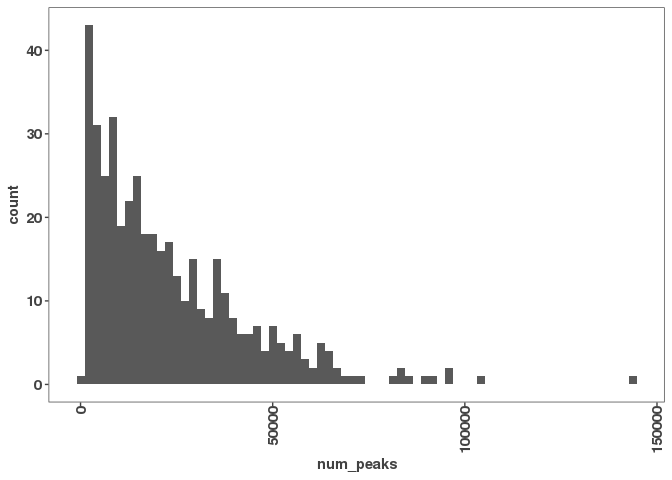 

## Finding out the ratio of num_peaks against genome_coverage
```r
ggplot(num_peaks_df, aes(x = num_peaks, y = total_peak_length)) +
  geom_point() + 
  geom_smooth(method = "gam", se = TRUE, color = "black", lty = 2)+
  ylab("BP covered") +
  xlab("Number of peaks") +
  ggtitle("Peak count vs. total bases covered")

```
 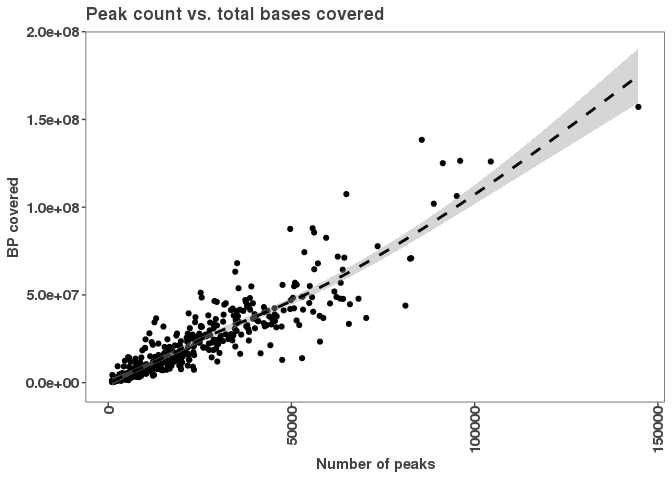  
 
 Result:
Here we see a linear relationship between the number of peaks and total coverage suggests that as the number of peaks increases, 
so does the total coverage.
 
 ## The plot for the number of peaks on promoters
 ```r
 ggplot(num_peaks_df,
       aes(x = num_peaks, y = peaks_overlapping_promoters)) +
  geom_point() +
  
  geom_abline(slope = 1, linetype="dashed") +
  geom_smooth(method = "lm", se=F, formula = 'y ~ x',
              color = "#a8404c") +
 # ggpubr prints equation
  stat_regline_equation()+
  # stat_regline_equation(label.x = 35000, label.y = 18000) +
  ylim(0,60100) +
  xlim(0,60100) +

  # adding labels
xlab("Peaks per DBP") +
  ylab("Number of peaks overlapping promoters") +
  ggtitle("Relationship Between Number of DBP Peaks and Promoter Overlaps")

ggsave("figures/3_peak_num_vs_promoter_coverage.pdf")

 ```
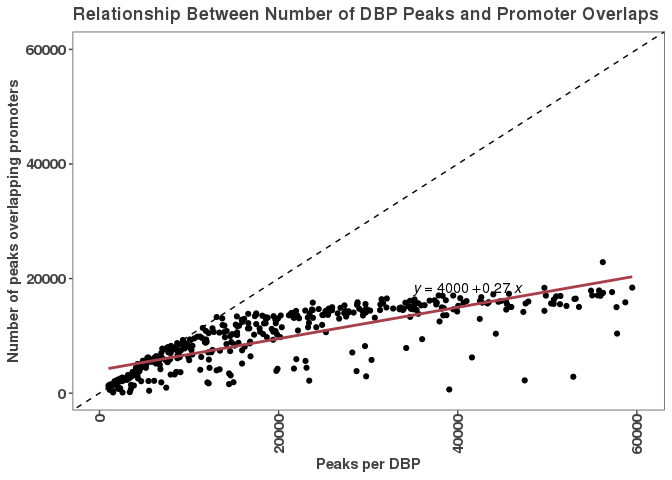 

Result: Here we see the number of peaks overlapping promoters and peaks per DBP. As the peaks per DBP increases, the number of peaks overlapping promoters
remains the same.

## Plotting peak Coverage on gene bodies
```r 
ggplot(num_peaks_df,
       aes(x = num_peaks, y = peaks_overlapping_genebody)) +
 geom_point() +
  
  geom_abline(slope = 1, linetype="dashed") +
  geom_smooth(method = "lm", se=F, formula = 'y ~ x',
              color = "#a8404c") +
  stat_regline_equation(label.x = 35000, label.y = 18000) +
  
  ylim(0,60100) +
  xlim(0,60100) +

  # adding labels
xlab("Peaks per DBP") +
  ylab("Number of peaks overlapping genes") +
  ggtitle("Relationship Between Number of DBP Peaks and Gene Body Overlaps")

ggsave("figures/4_peak_num_vs_gene_body_coverage.pdf")
```
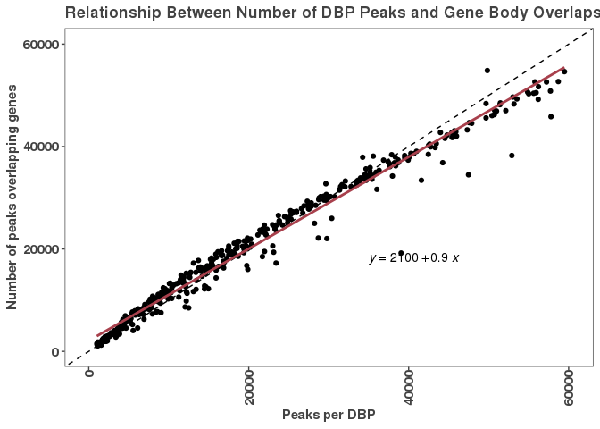  

Result: Here we see the number of peaks overlapping genes and peaks per DBP. As the peaks per DBP increases, the number of peaks overlapping promoters
increases, as well.

The difference between this plot and the previous one might be due to the fact that as the number of dbps increases, more potential binding sites for transcription factors and other regulatory proteins are available. This may lead to an increase in the number of peaks overlapping genes, as these factors bind to specific sequences in the DNA to regulate gene expression. On the other hand, the number of peaks overlapping promoters may not increase as much because promoter regions typically have specific sequences that are recognized by a limited set of regulatory factors. Once these binding sites are occupied by the appropriate factors, additional binding events may not occur as frequently as in the gene regions. Additionally, some promoters may be silenced or have low activity in certain conditions, leading to fewer peaks overall.


## Gene similarities via clustering
``` r
#let's look at the promoter peak occurence matrix (takes a min to load)
# read.table will make this a data.frame but will keep row names.
promoter_peak_occurence_matrix <- read.table("/scratch/Shares/rinnclass/CLASS_2023/Christopher/CLASS_2023/CLASSES/final_project/analysis/01_create_consensus_peaks/results/lncrna_mrna_promoter_peak_occurence_matrix.tsv")

# Converting to a matrix format for correlation analysis
promoter_peak_occurence_matrix <- as.matrix(promoter_peak_occurence_matrix)

# Now let's create distance matrix for each pairwise vector comparison for the whole matrix now.
peak_occurence_dist <- dist(promoter_peak_occurence_matrix, method = "binary")
peak_occurence_dist
```

    ##                       ADNP       AFF4      AHDC1        AHR      AKAP8
    ## AFF4            0.84962956                                            
    ## AHDC1           0.86369545 0.67243894                                 
    ## AHR             0.86263072 0.28007320 0.72729204                      
    ## AKAP8           0.86919299 0.33174052 0.74377765 0.19031814           
    ## ARID3A          0.86975556 0.70724817 0.75399604 0.74109197 0.76502909
    ## ARID4A          0.86744920 0.30931887 0.74102826 0.18317529 0.17068923
    .
    ##                     ARID3A     ARID4A     ARID4B     ARID5B      ARNTL                                                       
    ## ARID4A          0.76001870                                            
    ## ARID4B          0.74706889 0.14889819                                 
    ## ARID5B          0.75483716 0.19233234 0.10701280                      
    ## ARNTL           0.73026170 0.17870848 0.18059777 0.22155653           
    ## ASH2L           0.72578717 0.62847294 0.65121780 0.67130634 0.59765684
    ## ATAD3A          0.78115249 0.24654088 0.27286223 0.29528944 0.26983506
    .
    ##                      ASH2L     ATAD3A       ATF2       ATF3       ATF5                                                            
    ## ATAD3A          0.63936668                                            
    ## ATF2            0.60611563 0.27392823                                 
    ## ATF3            0.79785331 0.82735442 0.81148137                      
    ## ATF5            0.56501295 0.38154367 0.33297445 0.79345766           
    ## ATF6            0.55245958 0.32083897 0.20037279 0.78743710 0.29623581
    ## ATF7            0.60854530 0.28887140 0.21384074 0.81083821 0.31512061
    .
    ##                       ATF6       ATF7       BCL3       BCL6    BHLHE40                                                         
    ## ATF7            0.26012314                                            
    ## BCL3            0.28745170 0.23947516                                 
    ## BCL6            0.28155587 0.25443896 0.13345249                      
    ## BHLHE40         0.95470048 0.95711132 0.96330568 0.96337651           
    ## BRCA1           0.89052373 0.90264442 0.91816036 0.91748038 0.96924767
    ## CAMTA2          0.81085298 0.82343247 0.85089007 0.85156848 0.94408369
    .
    ##                      BRCA1     CAMTA2       CBFB       CBX5      CEBPA                                                     
    ## CAMTA2          0.88997257                                            
    ## CBFB            0.90524609 0.83029412                                 
    ## CBX5            0.91787777 0.85189649 0.18279303                      
    ## CEBPA           0.90764115 0.84323235 0.27474656 0.30487805           
    ## CEBPB           0.95157299 0.93615894 0.89751013 0.90539607 0.87324265
    ## CEBPD           0.91026446 0.83861752 0.14397923 0.17511073 0.24208304
    .
    ##                      CEBPB      CEBPD      CEBPG      CERS6       CHD2          
    ## CEBPD           0.88665321                                            
    ## CEBPG           0.88037692 0.18043464                                 
    ## CERS6           0.95763331 0.91800419 0.91782690                      
    ## CHD2            0.89957585 0.52344932 0.52650004 0.89397558           
    ## CREB3           0.91532329 0.69270942 0.69511415 0.77269758 0.67002865
    ## CREM            0.92106021 0.85622602 0.85231764 0.87620690 0.80212932
    .
    ##                      CREB3       CREM       CTCF        DBP      DDIT3
    .            
    ## CREM            0.81888909                                            
    ## CTCF            0.88632686 0.93014371                                 
    ## DBP             0.67776129 0.84461078 0.93544087                      
    ## DDIT3           0.77379830 0.81544202 0.91739050 0.77639553           
    ## DLX6            0.56186745 0.81821156 0.83833996 0.80267938 0.79105646
    ## DMAP1           0.67877362 0.84785340 0.82555932 0.87144122 0.84904266
    .
    ##                       DLX6      DMAP1      DMTF1      DNMT1       DPF2
    ## DMAP1           0.38029807                                            
    ## DMTF1           0.62574278 0.69434407                                 
    ## DNMT1           0.50954882 0.29300643 0.74825132                      
    ## DPF2            0.59769103 0.62319677 0.65915648 0.69515994           
    ## DRAP1           0.38184845 0.11885104 0.69640108 0.30751760 0.62365360
    ## DZIP1           0.46419049 0.45232944 0.63838384 0.52326221 0.64139942
    .
    .
    .

``` r
# Ready to cluster
bin_hier <- hclust(peak_occurence_dist, method = "complete")

# we now can plot the information in bin_hier
plot(hist(bin_hier$height), main="Peak Occurence Distribution",
     xlab="Peak Occurence", ylab="Frequency", pch=20,col="blue")
pdf("figures/dbp_hclust_dendro.pdf", height = 24, width = 50)
plot(hist(bin_hier$height), main="Peak Occurence Distribution",
     xlab="Peak Occurence", ylab="Frequency", pch=20,col="blue")
dev.off()
```


```r

#Now let's use GGDENDRO (dendrogram) package that will plot the branch lengths #that indicate how similar two samples are 
ggdendro::ggdendrogram(bin_hier, rotate = FALSE,  size = 3, 
                       theme_dendro = TRUE) +
   # 90 degree rotation to right
   coord_flip() +
   scale_y_continuous() +
   # adds label
   scale_x_continuous(position = "top") +
   # subsection to labels in order of clustering
   #scale_x_continuous(breaks = seq_along(bin_hier$labels[bin_hier$order]),
                      # adding labels that are in the order 'column'
             labels = bin_hier$labels[bin_hier$order], position = "top",
             expand = c(0,0)) +
   theme(axis.text.x = element_text(angle = 90, hjust  = 1)) + 
   theme(axis.text.y = element_text(angle = 0,hjust = 1)) +
   scale_y_reverse(expand = c(0.01, 0)) +
   theme(
     plot.background = element_blank(),
     panel.grid.major = element_blank(),
   panel.grid.minor = element_blank(),
     panel.border = element_blank()
   )
#saving the image
ggsave("/scratch/Shares/rinnclass/CLASS_2023/Christopher/CLASS_2023/CLASSES/final_project/analysis/03_clustering/figures/ggdendro_plot.pdf", height = 100, width = 22, limitsize = F)
```


We see here the clustering of genes based on similarities. SIN3B and HCFC1, for example, are quite different but quite similar in that they are
involved in protein-protein interactions and chromatin modelling. On the other hand, TBP, a transcription factor, is dissimilar from H3K79me2 used 
in histone modifications.

## Clustering lncrna and mrna separately
``` r
# loading lncRNA promoters
lncrna_mrna_promoters <- rtracklayer::import("/scratch/Shares/rinnclass/CLASS_2023/Christopher/CLASS_2023/CLASSES/my_results/my_gene_annotation/lncrna_mrna_promoters.gtf")

# now we can split into lncRNA and mRNA
lncrna_promoters <- lncrna_mrna_promoters[lncrna_mrna_promoters$gene_type == "lncRNA"]

# mrna promoters
mrna_promoters <- lncrna_mrna_promoters[lncrna_mrna_promoters$gene_type == "protein_coding"]

# Now we will use indexing to separate peak_occurrence_matrix in lncRNA and mRNA.
# note we are indexing and using indexing in indexing to get what we want.
lncrna_peak_occurence <- promoter_peak_occurence_matrix[,lncrna_promoters$gene_id]

# we do the clutering the same as above or we can combine the dist and hclust:
bin_hier_lncrna <- hclust(dist(lncrna_peak_occurence, method = "binary"))

# Now plot with ggdendro
ggdendro::ggdendrogram(bin_hier_lncrna, rotate = T,  size = 3)

# Now let's save this figure
ggsave("figures/lncrna_hclust_binary_dist.pdf", height = 49, width = 6)
```
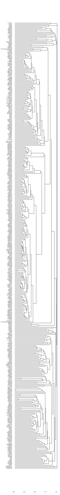 

```r

#getting the gencode_gr again
gencode_gr <- rtracklayer::import("/scratch/Shares/rinnclass/CLASS_2023/data/data/genomes/gencode.v32.annotation.gtf")

# now just type == gene annotations
gencode_genes <- gencode_gr[gencode_gr$type == "gene"] 
table(gencode_gr$type)

# exporting all genes file (we will save all the .Rdata too at the end)
rtracklayer::export(gencode_genes, "/scratch/Shares/rinnclass/CLASS_2023/Christopher/CLASS_2023/CLASSES/final_project/analysis/03_clustering/results/gene_annotation/gencode_genes.gtf")

# mRNA genes (called "protein_coding") in this version of gencode changes sometimes !
mrna_genes <- gencode_genes[gencode_genes$gene_type %in% "protein_coding"] 
rtracklayer::export(mrna_genes, "/scratch/Shares/rinnclass/CLASS_2023/Christopher/CLASS_2023/CLASSES/final_project/analysis/03_clustering/results/gene_annotation/mrna_genes.gtf")
table(gencode_genes$gene_type)

# now doing a second index for lncRNA:
lncrna_genes <- gencode_genes[gencode_genes$gene_type %in% "lncRNA"] 
rtracklayer::export(lncrna_genes, "/scratch/Shares/rinnclass/CLASS_2023/Christopher/CLASS_2023/CLASSES/final_project/analysis/03_clustering/results/gene_annotation/lncrna_genes.gtf")

# both mRNA and lncRNA annotations together.
mrna_lncrna_genes <- gencode_genes[gencode_genes$gene_type %in% c("protein_coding","lncRNA")]
rtracklayer::export(mrna_lncrna_genes, "/scratch/Shares/rinnclass/CLASS_2023/Christopher/CLASS_2023/CLASSES/final_project/analysis/03_clustering/results/gene_annotation/mrna_lncrna_genes.gtf")

# starting annotation file that we will use moving forward.
lncrna_mrna_genes <- rtracklayer::import("/scratch/Shares/rinnclass/CLASS_2023/Christopher/CLASS_2023/CLASSES/final_project/analysis/03_clustering/results/gene_annotation/mrna_lncrna_genes.gtf")

# converting to data frame
lncrna_mrna_genes_df <- lncrna_mrna_genes %>% as.data.frame()

# creating and exporting promoter annotations
lncrna_mrna_promoters <- promoters(lncrna_mrna_genes, upstream = 1000, downstream = 1000)

# check right size
width(lncrna_mrna_promoters)
rtracklayer::export(lncrna_mrna_promoters, "/scratch/Shares/rinnclass/CLASS_2023/Christopher/CLASS_2023/CLASSES/final_project/analysis/03_clustering/results/gene_annotation/lncrna_mrna_promoters.gtf")

# Clustering of lncRNA and mRNA seperately
#Now let's compare how lncRNAs and mRNAs cluster differnently?
#Strategy: load annotations then index peak_occurrence for specific annotations
# lncRNA promoters ggdendro
lncrna_mrna_promoters <- rtracklayer::import("/scratch/Shares/rinnclass/CLASS_2023/Christopher/CLASS_2023/CLASSES/final_project/analysis/01_create_consensus_peaks/results/gene_annotations/lncrna_mrna_promoters.gtf")

# now we can split into lncRNA and mRNA
lncrna_promoters <- lncrna_mrna_promoters[lncrna_mrna_promoters$gene_type == "lncRNA"]

# mrna promoters
mrna_promoters <- lncrna_mrna_promoters[lncrna_mrna_promoters$gene_type == "protein_coding"]

# Now we will use indexing to separate peak_occurrence_matrix in lncRNA and mRNA.
# note we are indexing and using indexing in indexing to get what we want.
lncrna_peak_occurence <- promoter_peak_occurence_matrix[,lncrna_promoters$gene_id]

# we do the clutering the same as above or we can combine the dist and hclust:
bin_hier_lncrna <- hclust(dist(lncrna_peak_occurence, method = "binary"))

# Now plot with ggdendro
ggdendro::ggdendrogram(bin_hier_lncrna, rotate = T,  size = 3)

# Now let's save this figure
ggsave("/scratch/Shares/rinnclass/CLASS_2023/Christopher/CLASS_2023/CLASSES/final_project/analysis/03_clustering/figures/lncrna_hclust_binary_dist.pdf", height = 49, width = 6)

# mRNA promter ggdendro
#Now for mRNA
# same strategy used very often:
# indexing into larger file and filtering to a file of stuff you want.
mrna_peak_occurence <- promoter_peak_occurence_matrix[,mrna_promoters$gene_id]

# getting the distance matrix for only mRNA promoters  
bin_hier_mrna <- hclust(dist(mrna_peak_occurence, method = "binary"))
# plotting with ggdendro
ggdendro::ggdendrogram(bin_hier, rotate = TRUE,  size = 3)
#they look alike because the combination of the overlaps are the same for mRNA and lncRNA i.e. similar binding profiles.
# saving
ggsave("/scratch/Shares/rinnclass/CLASS_2023/Christopher/CLASS_2023/CLASSES/final_project/analysis/03_clustering/figures/mrna_hclust_binary_dist.pdf", height = 44, width = 6)

save(bin_hier_mrna, mrna_peak_occurence, bin_hier_lncrna, lncrna_peak_occurence, lncrna_promoters, mrna_promoters, lncrna_mrna_promoters, lncrna_mrna_genes, lncrna_mrna_genes_df, mrna_lncrna_genes, lncrna_genes, mrna_genes, gencode_genes, file = "results/clustering_features.RData")
```
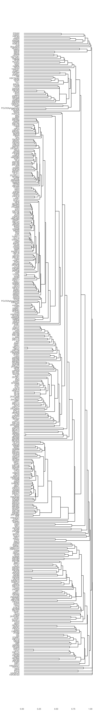 

Notes: lncRNA and mRNA cluster differently. mRNA is more likely to cluster based on functions and regulations, while lncRNA  is more likely
to cluster based on their specific biological roles.
The co-occurrence of H3K36me3 and H3K9me3 modifications in both areas of the mRNA and lncRNA clusters could suggest that there could be functional interaction between them in regulating transcription and RNA processing.
This is also reflective in the co-occurrence of MLX and ZBTB21 and could suggest that they are involved in regulating transcription and chromatin organization
of all types of genes, rather than being specific to a particular type of transcript. 

## Creating metaplots initial objects
``` r
# loading in needed files from 01_peak_features
consensusPeakPath <- "/scratch/Shares/rinnclass/CLASS_2023/Christopher/CLASS_2023/CLASSES/final_project/analysis/01_create_consensus_peaks/results/consensus"
consensus_peaks_files <- list.files(consensusPeakPath, 
                                             pattern = "*.bed",
                                             full.names = TRUE)

# lapply with import function to make a list of GRanges
consensus_peaks <- lapply(consensus_peaks_files, rtracklayer::import)

#file.path(basepath, peak_path)
# adding DBP name to each list of GRanges from the file name
# note gsub requires no space around or argument ( | )

names(consensus_peaks) <- gsub("/scratch/Shares/rinnclass/CLASS_2023/Christopher/CLASS_2023/CLASSES/final_project/analysis/01_create_consensus_peaks/results/consensus/|_consensus.bed","", consensus_peaks_files)
```

## Metaplot for all dps on lncRNA and mRNA promoters
``` r
# making promoters (again, to be safe)
lncrna_promoters <- lncrna_mrna_promoters[lncrna_mrna_promoters$gene_type == "lncRNA"]
mrna_promoters <- lncrna_mrna_promoters[lncrna_mrna_promoters$gene_type == "protein_coding"]
```

## Metaplot for lncRNA
``` r
#setting up lncrna DF.
lncrna_metaplot_df <- data.frame(x = integer(), dens = numeric(), dbp = character())

# for loop to populate DF with overlap density in lncrna promoters
for(i in 1:length(consensus_peaks)) {
  print(names(consensus_peaks)[[i]])
  tmp_df <- profile_tss(consensus_peaks[[i]], lncrna_mrna_promoters = lncrna_promoters)
  tmp_df$dbp <- names(consensus_peaks)[[i]]
  lncrna_metaplot_df <- bind_rows(lncrna_metaplot_df, tmp_df)
}

lncrna_metaplot_df$gene_type <- "lncRNA"

pdf("metaplots/lncrna_promoter_metaplot.pdf", height = 200, width = 32)
par(cex=2.5)

ggplot(lncrna_metaplot_df, 
       aes(x = x, y = dens, color = gene_type )) +
  geom_vline(xintercept = 0, lty = 2) + 
  geom_line(size = 2.5) + 
  facet_wrap(dbp ~ ., scales = "free_y") +
  ggtitle("lncrna metaplot promoter") + 
  scale_x_continuous(breaks = c(-1000, 0, 1000),
                     labels = c("-1kb", "TSS", "+1kb"),
                     name = "") + 
  ylab("Peak frequency") +
  scale_color_manual(values = c("#424242","#a8404c"))

dev.off()
```
 

Results:  There are some "rough plots". A "rough plot", for example EP300, could indicate that there is significant variability in the level of histone acetylation at lncRNA promoters across the different samples being analyzed. This could be due to differences in the levels of EP300 itself, or to differences in the activity 
of other factors that regulate histone acetylation. It is also possible that some lncRNA promoters are more sensitive to changes in EP300 activity
than others, leading to a more variable metaplot. In the case of KAT2B, the shape of the metaplot can be influenced by a variety of factors, such as the distribution of regulatory elements in the promoter region, the expression level and activity of transcription factors and chromatin modifiers, and the underlying epigenetic landscape. The HMGA1 has an empty plot, it could mean that this particular transcription factor is not strongly associated with the regulation of lncRNA expression in the system being studied. The H4K20me1 plots in the opposite direction; it could indicate a difference in the way this histone modification is associated with lncRNA expression compared to other histone modifications being analyzed. 

## Metaplot for mRNA
``` r
mrna_metaplot_df <- data.frame(x = integer(), dens = numeric(), dbp = character())

for(i in 1:length(consensus_peaks)) {
  print(names(consensus_peaks)[[i]])
  tmp_df <- profile_tss(consensus_peaks[[i]], lncrna_mrna_promoters = mrna_promoters)
  tmp_df$dbp <- names(consensus_peaks)[[i]]
  mrna_metaplot_df <- bind_rows(mrna_metaplot_df, tmp_df)
}

mrna_metaplot_df$gene_type <- "mRNA"

pdf("metaplots/mrna_promoter_metaplot.pdf", height = 150, width = 32)
par(cex=2.3)

ggplot(mrna_metaplot_df, 
       aes(x = x, y = dens, color = gene_type )) +
  geom_vline(xintercept = 0, lty = 2) + 
  geom_line(size = 1.5) + 
  facet_wrap(dbp ~ ., scales = "free_y") +
  ggtitle("mrna metaplot promoter") + 
  scale_x_continuous(breaks = c(-1000, 0, 1000),
                     labels = c("-1kb", "TSS", "+1kb"),
                     name = "") + 
  ylab("Peak frequency") +
  scale_color_manual(values = c("#424242","#a8404c"))
dev.off()
```
 

Results: H3K9me3 has a "rough plot"; it is generally associated with transcriptional repression, and so it could indicate that the 
region being analyzed is a repressed region of the promoter. Also, the H4K20me1 modification is known to be associated with transcriptional 
repression and heterochromatin formation, so an opposite direction plot could suggest the presence of heterochromatin-like regions upstream 
of the TSS. 

##  Metaplot for both mRNA and lncRNA
``` r
combined_metaplot_profile <- bind_rows(mrna_metaplot_df, lncrna_metaplot_df)

pdf("figures/combined_promoter_metaplot.pdf", height = 150, width = 32)
par(cex=2.3)

# plotting
ggplot(combined_metaplot_profile, 
       aes(x = x, y = dens, color = gene_type )) +
  geom_vline(xintercept = 0, lty = 2) + 
  geom_line(size = 1.5) + 
  facet_wrap(dbp ~ ., scales = "free_y") +
  ggtitle("Combined Promoter Metaplot") + 
  scale_x_continuous(breaks = c(-1000, 0, 1000),
                     labels = c("-1kb", "TSS", "+1kb"),
                     name = "") + 
  ylab("Peak frequency") +
  scale_color_manual(values = c("#424242","#a8404c"))
dev.off()
```
 

## plotting the density of DBP localization events
``` r
peak_occurence_df <- read.csv("/scratch/Shares/rinnclass/CLASS_2023/Christopher/CLASS_2023/CLASSES/final_project/analysis/01_create_consensus_peaks/results/peak_occurence_dataframe.csv")

ggplot(peak_occurence_df, aes(x = number_of_dbp)) +
geom_density(alpha = 0.2, color = "#424242", fill = "#424242") +
  theme_paperwhite() +
  xlab(expression("Number of DBPs")) +
  ylab(expression("Density")) +
  ggtitle("Promoter binding events",
          subtitle = "mRNA and lncRNA genes")

#saving
ggsave("/scratch/Shares/rinnclass/CLASS_2023/Christopher/CLASS_2023/CLASSES/final_project/analysis/metaplots/num_binding_events_per_promoter.pdf")
```
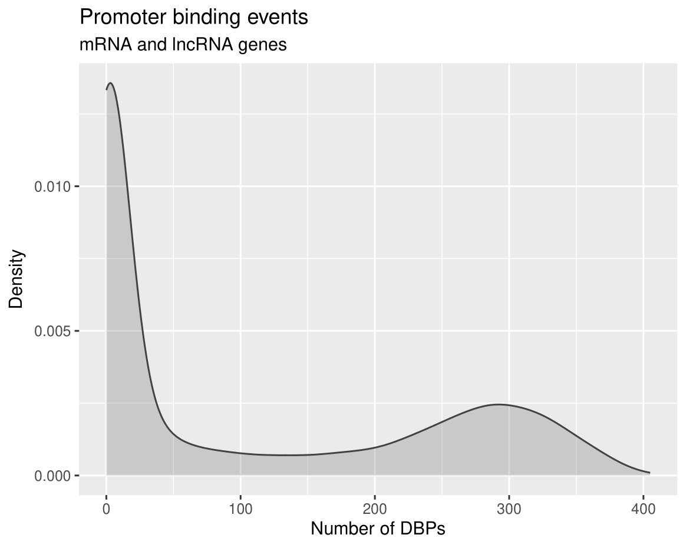 

Results: 
1. The first thing noticed is that there are two regions where the binding is more concentrated compared to other regions, which could indicate two different populations or modes of binding.  
2. Then we see inconsistency in the distribution: majority of the promoters lean towards 100 dbps, and a second minor peak beaks after 200 dbps and drops on 400 dbps. 
3. From this distribution, we can then extract the superbinders.

## Promoters without binding events
```r
# here is just a simple index and filter of the index to have at least 1 dbp bound.
unbound_promoters <- peak_occurence_df %>% 
  filter(peak_occurence_df$number_of_dbp < 1)

# how many are there?
nrow(unbound_promoters)

#saving
write_csv(unbound_promoters, "results/unbound_promoters.csv")
```
Result:
The number of promoter without binding events is 9448.

## lncRNA versus mRNA promoter binding
```r
num_peaks_dfl <- num_peaks_df %>%
  dplyr::select(-peaks_overlapping_promoters) %>%
  
  # We will discuss pivot longer in the next class (BUT IF YOUR INTERESTED ASK NOW IT'S WORTH IT!!)
  pivot_longer(cols = peaks_overlapping_lncrna_promoters:peaks_overlapping_mrna_promoters,
               names_to = "gene_type",
               values_to = "peaks_overlapping_promoters") %>%
  mutate(gene_type = gsub("peaks_overlapping_", "", gene_type))

# plotting
ggplot(num_peaks_dfl, aes(x = num_peaks, y = peaks_overlapping_promoters, 
                         col = gene_type)) +
  geom_point() +
  
         geom_abline(slope = 1, linetype="dashed") +
  geom_smooth(method = "lm", se = FALSE, formula = "y ~ x") +
  
  stat_regline_equation() +
  
  scale_color_manual(values = c("#a8404c", "#424242"))+
  
  xlab("Peaks per DBP") +
  ylab("Peaks Overlapping Promoters") +
  ggtitle("Number of DBP Peaks and Promoter Overlaps")

ggsave("figures/peaks_overlaps_relationship_by_gene_type.pdf", height = 5, width = 8)
```
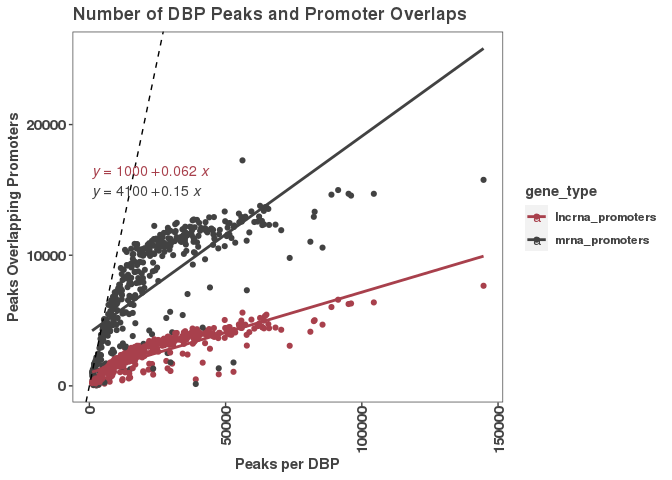 

Result:
1. Here we see that the mRNA promoters have a higher number of peaks that overlap with promoter regions than lncRNA promoters.
2. mRNA promoters could likely have more regulatory regions than lncRNA promoters.
3. Also, there could be more transcription factors and other proteins binding to mRNA promoters than lncRNA promoters.

## Beginning of RNASeq expression
``` r
# First let's read in the sample sheet to know what is what
samplesheet <- read_rds("/scratch/Shares/rinnclass/CLASS_2023/Christopher/CLASS_2023/CLASSES/05_R_analyses/05_RNAseq/01_differential_expression/results/final_samplesheet.rds")

# reading in salmon tpm
salmon_tpm <- read.csv("/scratch/Shares/rinnclass/CLASS_2023/Christopher/CLASS_2023/CLASSES/05_R_analyses/05_RNAseq/00_RNAseq_download_NF_core_pipeline/00_NF_CORE_RNAseq_Pipeline_run/results/salmon/salmon_merged_gene_tpm.csv")

colnames(salmon_tpm)[1] <- "gene_id"

tpm <- salmon_tpm %>% 
  pivot_longer(cols = 2:ncol(.), names_to = "sample_id", values_to = "tpm") %>%
  merge(samplesheet) %>%
  group_by(gene_id, condition) %>%
  summarize(tpm = mean(tpm, na.rm = T)) %>%
  pivot_wider(names_from = condition, values_from = tpm, names_prefix = "tpm_")
  merge(samplesheet) %>%
    
# Now we can merge in the TPM data to this data.frame
# This will merge on the on teh gene_id column
#promoter_features_df <- merge(peak_occurence_df, tpm)
```

## Number of dbps bound on density plot
``` r
# let's plot the number of DBPs bound as a densuty plot.
ggplot(promoter_features_df, aes(x = number_of_dbp)) +
  geom_density() 

# Let's save
ggsave("/scratch/Shares/rinnclass/CLASS_2023/Christopher/CLASS_2023/CLASSES/final_project/analysis/04_binding_vs_expression/figures/DBP_binding_density_plot.pdf")
```
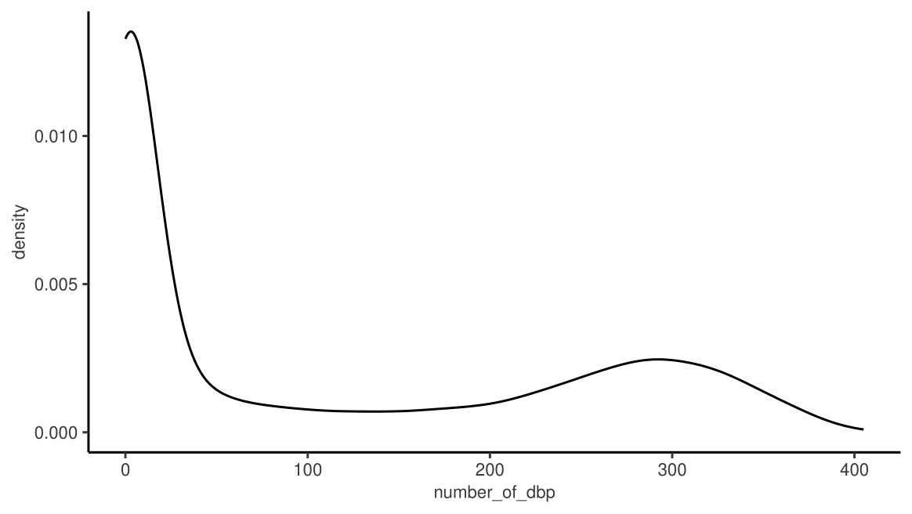  

## Heatmap of genes variable across samples
``` r
# First we need to the tpm DF into a matrix
tpm_matrix <- tpm %>% 
  column_to_rownames("gene_id") %>%
  as.matrix()

# And z-scale each row.
tpm_scaled <- t(scale(t(tpm_matrix)))

# clearing all possible NAs
tpm_scaled <- tpm_scaled[complete.cases(tpm_scaled),]

# Create heatmap using pheatmap function
heatmap <- pheatmap(tpm_scaled, show_rownames = FALSE)

# Save the heatmap in a PDF file
pdf("/scratch/Shares/rinnclass/CLASS_2023/Christopher/CLASS_2023/CLASSES/final_project/analysis/metaplots/tpm_heatmap.pdf", height = 20, width = 22)
heatmap
dev.off()
```
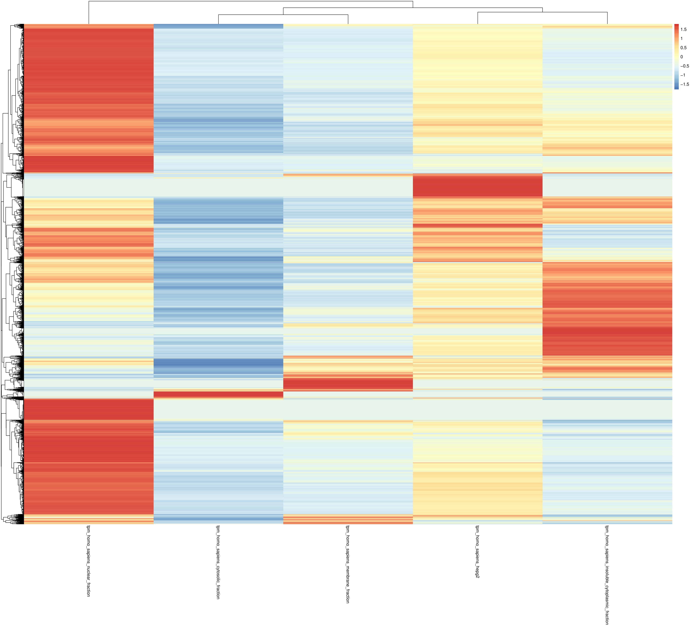  

 Result: Some RNAs may function primarily within the nucleus, such as non-coding RNAs involved in transcriptional regulation, while others may function primarily in the cytoplasm, such as mRNAs that are translated into proteins.

## Plotting binding vs expression
``` r
promoter_features_df <- read.csv("/scratch/Shares/rinnclass/CLASS_2023/Christopher/CLASS_2023/CLASSES/final_project/analysis/04_binding_vs_expression/results/promoter_feature_df_tpm.csv")

# Plotting binding versus expression
ggplot(promoter_features_df, 
       aes(y = log2(tpm_homo_sapiens_hepg2 + 0.001), x = number_of_dbp, color = gene_type)) + 
  geom_point(data = promoter_features_df %>% filter(tpm_homo_sapiens_hepg2 > 0.001),
             shape = 17, alpha = 0.7) +
  
  # Adding a generative additive model 
  geom_smooth(method = 'gam', formula = y ~ s(x, bs = "cs")) +
  # this adds the statistics from the gam to the figure
  stat_cor() +
  geom_smooth(method = "lm") +
  scale_x_continuous(expand = c(0,0)) +
  # adding colors manually
  scale_color_manual(values = c("#a8404c", "#424242"), name = "Gene type") + 
  # title
  ggtitle("Expression vs. promoter binding events") + 
  # labeling axes
  xlab(expression('Number of TFs')) +
  ylab(expression(log[2](TPM))) 
save plot
ggsave("/scratch/Shares/rinnclass/CLASS_2023/Christopher/CLASS_2023/CLASSES/final_project/analysis/04_binding_vs_expression/figures/binding_vs_expression.pdf")
```
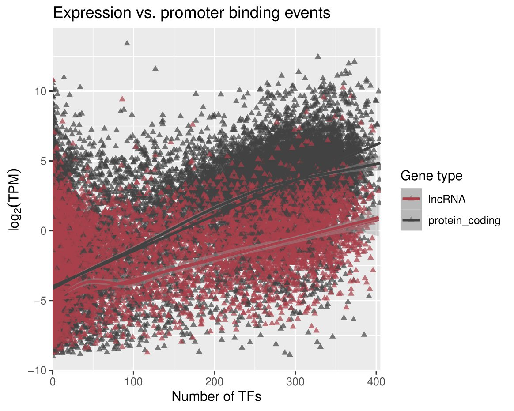  

Result: 
1. We see a linear trend with the number of DBPs and expression levels. This could suggest a positive correlation between the two variables. In other words, as the number of DBPs increases, so does the expression level of the associated genes. This trend could indicate that DBPs play a role in regulating gene expression, potentially by binding to specific DNA sequences in gene promoters and modulating transcription. 
  
## Heatmap of nuclear versus cytoplasmic expression
``` r
# Now let's make a similar plot for nuclear RNA abundance versus #DBPs bound to their promoter
ggplot(promoter_features_df, 
       aes(y = log2(tpm_homo_sapiens_nuclear_fraction + 0.001), x = number_of_dbp, color = gene_type)) + 
  geom_point(data = promoter_features_df %>% filter(tpm_homo_sapiens_nuclear_fraction > 0.001),
             shape = 17, alpha = 0.7) +
  geom_smooth(method = 'gam', formula = y ~ s(x, bs = "cs")) +
  stat_cor() +
  scale_x_continuous(expand = c(0,0)) +
  scale_color_manual(values = c("#a8404c", "#424242"), name = "Gene type") + 
  ggtitle("Nuclear Expression vs. promoter binding events") + 
  xlab(expression('Number of TFs')) +
  ylab(expression(log[2](TPM))) 
# saving figure
ggsave("/scratch/Shares/rinnclass/CLASS_2023/Christopher/CLASS_2023/CLASSES/final_project/analysis/04_binding_vs_expression/figures/nuclear_expression-vs-promoter_binding.pdf")
```
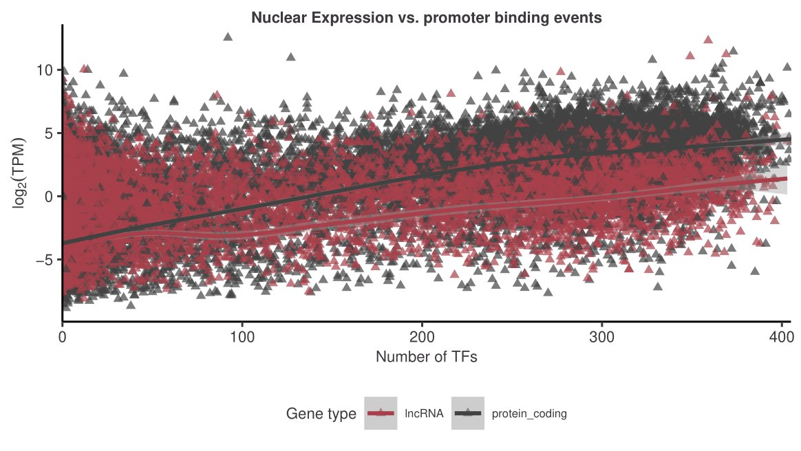  

## Is there a difference between cyto RNAs versus DBPs on promoter?
``` r
ggplot(promoter_features_df, 
      aes(y = log2(tpm_homo_sapiens_cytosolic_fraction + 0.001), x = number_of_dbp, color = gene_type)) + 
  # note if we take off the log2 everything is very lowly expressed
  geom_point(data = promoter_features_df %>% filter(tpm_homo_sapiens_cytosolic_fraction > 0.001),
             shape = 17, alpha = 0.7) +
  geom_smooth(method = 'gam', formula = y ~ s(x, bs = "cs")) +
  stat_cor() +
  scale_x_continuous(expand = c(0,0)) +
  scale_color_manual(values = c("#a8404c", "#424242"), name = "Gene type") + 
  ggtitle("Cytoplasmic Expression vs. promoter binding events") + 
  xlab(expression('Number of TFs')) +
  ylab(expression(log[2](TPM))) 
# saving figure
ggsave("/scratch/Shares/rinnclass/CLASS_2023/Christopher/CLASS_2023/CLASSES/final_project/analysis/04_binding_vs_expression/figures/cytoplasmic_expression-vs-promoter_binding.pdf")
```
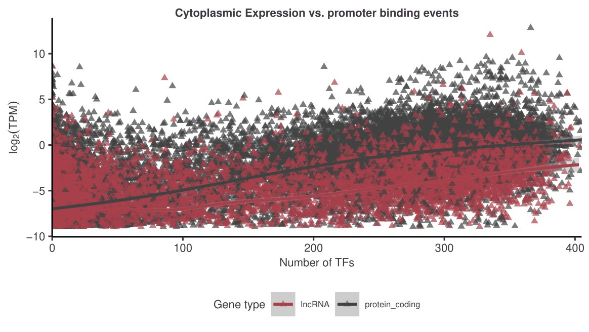  

## This is another way to look at it
``` r
# the main function here is color by gene_type in promoter_features_df
ggplot(promoter_features_df, aes(x = log2(tpm_homo_sapiens_hepg2 + 0.01), color = gene_type))+
 geom_density()
# saving figure
ggsave("/scratch/Shares/rinnclass/CLASS_2023/Christopher/CLASS_2023/CLASSES/final_project/analysis/04_binding_vs_expression/figures/mrna_lncrna_tpm_total_rna.pdf")
# let's also do the same for nuclear since lncRNAs are typically more nuclear
ggplot(promoter_features_df, aes(x = log2(tpm_homo_sapiens_nuclear_fraction + 0.01), color = gene_type))+
  geom_density()
# saving figure
ggsave("/scratch/Shares/rinnclass/CLASS_2023/Christopher/CLASS_2023/CLASSES/final_project/analysis/04_binding_vs_expression/figures/mrna_lncrna_tpm_nuclear.pdf")
```
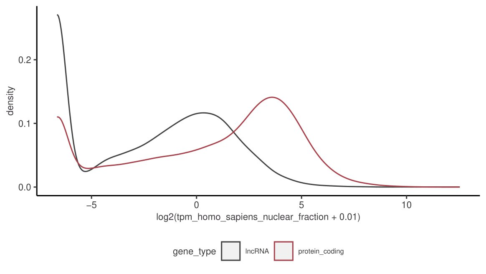 

Result:
This shows clearly that protein coding has a higher expression than lncRNA.

## Extracting proteins without expressions from high-binding proteins
``` r
# filter to super binders
promoter_occurence_df<- peak_occurence_df %>%
  mutate(superbinders = peak_occurence_df$number_of_dbp > 200)
# setting col of superbinders
promoter_occurence_df<- peak_occurence_df %>%
  mutate(superbinder_or_not = ifelse(promoter_occurence_df$superbinders == TRUE, "Superbinder", "notsuperbinder"))

# superbinder promoters
superbinder_promoters <- subset(promoter_occurence_df, superbinder_or_not == "Superbinder")
superbinder_promoters <- dplyr::select(superbinder_promoters, "gene_id")


# non super binder proms
non_superbinder_promoters<- subset(promoter_occurence_df, superbinder_or_not == "notsuperbinder")
non_superbinder_promoters <- dplyr::select(non_superbinder_promoters, "gene_id")


# subet mRNA and lncRNA promoters by super binders
super_lncrna_mrna_gr <- lncrna_mrna_promoters[lncrna_mrna_promoters$gene_id %in% superbinder_promoters$gene_id]
non_super_lncrna_mrna_gr <- lncrna_mrna_promoters[lncrna_mrna_promoters$gene_id %in% non_superbinder_promoters$gene_id]

# setting up superbinders metaplot_Df
superbinder_metaplot_df <- data.frame(x = integer(), dens = numeric(), dbp = character())
lncrna_mrna_promoters = super_lncrna_mrna_gr
# for loop to populate super binder _metaplot
for(i in 1:length(filtered_consensus_list)) {
  print(names(filtered_consensus_list)[[i]])
  tmp_df <- profile_tss(filtered_consensus_list[[i]], lncrna_mrna_promoters)
  tmp_df$dbp <- names(filtered_consensus_list)[[i]]
  superbinder_metaplot_df <- bind_rows(superbinder_metaplot_df, tmp_df)
}

# setting up non_superbinder_promoters metaplot_Df
non_superbinder_promoters <- data.frame(x = integer(), dens = numeric(), dbp = character())
lncrna_mrna_promoters = non_superbinder_promoters
# for loop to populate super binder _metaplot
for(i in 1:length(filtered_consensus_list)) {
  print(names(filtered_consensus_list)[[i]])
  tmp_df <- profile_tss(filtered_consensus_list[[i]], lncrna_mrna_promoters)
  tmp_df$dbp <- names(filtered_consensus_list)[[i]]
  non_superbinder_promoters<- bind_rows(non_superbinder_promoters, tmp_df)

non_superbinder_metaplot_df$gene_type <- "non_super_binder"
superbinder_metaplot_df$gene_type <- "superbinder"
combined_super_binder_metaplot_profile <- bind_rows(non_superbinder_metaplot_df, superbinder_metaplot_df)

ggplot(combined_super_binder_metaplot_profile, aes(x = x, y = dens, color = gene_type)) +
  geom_vline(xintercept = 0, lty = 2) + 
  geom_line(size = 1.5) +
  facet_wrap(~ dbp, scales = "free_y") +
  ggtitle("Promoter Metaplot") + 
  scale_x_continuous(breaks = c(-1000, 0, 1000),
                     labels = c("-1kb", "TSS", "+1kb"),
                     name = "") + 
  ylab("Peak frequency") +
  xlab("Distance from TSS") +  # add label to x-axis
  scale_color_manual(values = c("#424242", "#a8404c"))
ggsave("/scratch/Shares/rinnclass/CLASS_2023/Christopher/CLASS_2023/CLASSES/final_project/analysis/metaplots/superbinder_metaplot.pdf")
```
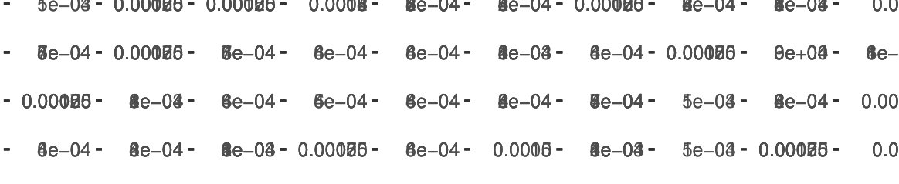 
Result: There are 11, 689 genes that are superbinders. Out of this number, there appears to be more mRNA superbinders than lncRNA superbinders.

## Defining HEPG2 reservoirs
```r
promoter_features_df$hepg2_reservoir <- 
  as.numeric(promoter_features_df$number_of_dbp > 5 & 
               promoter_features_df$tpm_homo_sapiens_hepg2 < 0.001)

# seeing what we got with table
table(promoter_features_df$hepg2_reservoir)
```
Result:
  Shows 2360 in the larger dataset in HEPG2.

## Determining how many that are similar genomic regions in k562 and hepG2.
```{r reading in K562 reservoirs}

k562_df <- read_csv("/scratch/Shares/rinnclass/CLASS_2023/data/data/2020_k562_promoter_peak_df.csv")

# saving for future use this was hard to find :)
write_csv(k562_df, "results/2020_k562_promoter_peak_df.csv")

# next we want to merge the k562 adn Hepg2 DFs 
# first we should label what is k562 and what is Hepg2


# K562_df renaming :

k562_df <- k562_df %>% 
  dplyr::select(gene_id, reservoir, conservative_reservoir, tpm, expression, tf_binding, promoter_mean_tpm, promoter_median_tpm, promoter_max_tpm) %>%
  dplyr::rename(k562_reservoir = reservoir, 
                k562_conservative_reservoir = conservative_reservoir,
                k562_expression = expression,
                k562_tpm = tpm,
                k562_tf_binding = tf_binding,
                k562_promoter_mean_tpm =  promoter_mean_tpm,
                k562_promoter_median_tpm = promoter_median_tpm,
                k562_promoter_median_tpm = promoter_median_tpm,
                k562_promoter_max_tpm = promoter_max_tpm)

# save this file in new format
write_csv(k562_df,"results/k562_df.csv")

# testing read in for future use
k562_df <- read_csv("k562_df.csv")

# renaming promoter_features_df to hepg2_df

hepg2_df <- promoter_features_df %>%
  dplyr::select(gene_id, gene_name, tpm_homo_sapiens_hepg2, tpm_homo_sapiens_cytosolic_fraction, tpm_homo_sapiens_nuclear_fraction, tpm_homo_sapiens_insoluble_cytoplasmic_fraction, tpm_homo_sapiens_membrane_fraction, number_of_dbp, hepg2_reservoir) %>%
  dplyr::rename( tpm_total = tpm_homo_sapiens_hepg2,
                 tpm_cytosolic_fraction =  tpm_homo_sapiens_cytosolic_fraction,
                 tpm_nuclear_fraction = tpm_homo_sapiens_nuclear_fraction ,
                 tpm_insoluble_cytoplasmic_fraction = tpm_homo_sapiens_insoluble_cytoplasmic_fraction ,
                 tpm_membrane_fraction = tpm_homo_sapiens_membrane_fraction)

# let's save this handy file
write_csv(hepg2_df,"hepg2_df.csv")

# Let's merge the k562 reservoirs in with HEPG2_df
# Merges on Gene_id
hepg2_k562_promoter_features_df <- merge(hepg2_df, k562_df)

# Now saving
write_csv(hepg2_k562_promoter_features_df, "hepg2_k562_promoter_features_df.csv")

# Make a table of reservoir status
res_status <- hepg2_k562_promoter_features_df %>% 
  #  !! another useful combination of group_by and summarize !!
  group_by(hepg2_reservoir, k562_reservoir, k562_conservative_reservoir) %>%
  summarize(count = n())

# saving for future
write_csv2(res_status, "reservoir_overlap_stats.csv")
```
Result: 
1. There are 345 high-binding proteins that are not expressed in both K562 and HEPG2. 
2. There are 80 Hepg2 reservoirs that overlap conservative k562 reservoirs.
